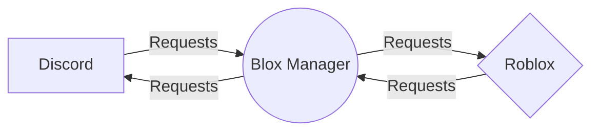
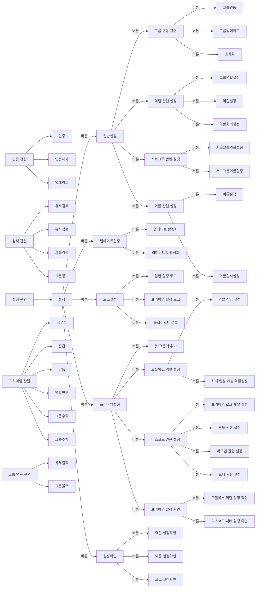

# Blox Manager
- This is a Discord Bot.
- This is a bot that has passed Discord's verification process.
#### Bot Status
- Serer DataBase: 700+
- Authenticator DataBase: 10k+
- Premium Server: 200+
- Joined Server: 600+

---
- Bot Name: `Blox Manager` 
- Roblox Bot Account: `Blox_ManagerBot` 
- Language: `Korean`
- How To Contact Developer: `easytopy` <-- Discord ID

---
#### Since 2020. 9. 10
###### Bot Name & Bot Account Change
##### NastyCore (2020. 9. 10) -> SparkleSystem (2022.7.15) -> Blox Manager (2023.10.7 ~)
---
### working structure

# Links
- [Blox Manager Discord App Directory](https://discord.com/application-directory/1160070137580363787)
- [Blox Manager Guide - YouTube](https://www.youtube.com/@BloxManager)
- [Blox Manager Wiki - GitBook](https://wiki.blox-manager.kro.kr/)
- [Support Community - Discord](https://discord.gg/ANeNwBAt7m)
## Commands

